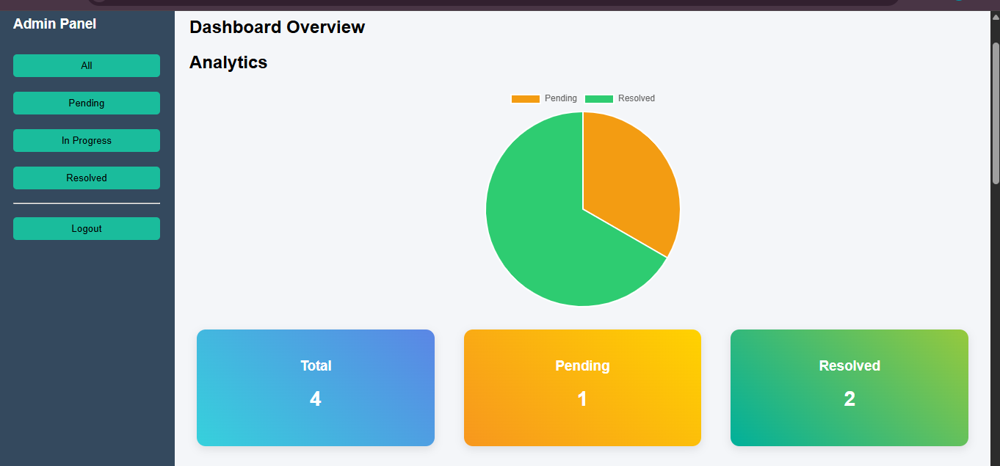
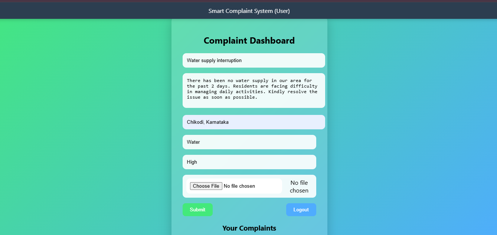
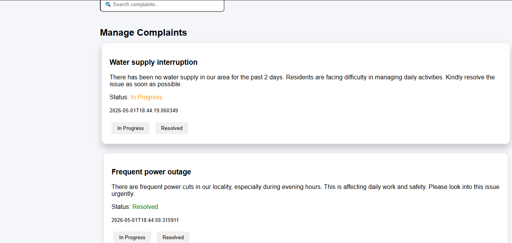
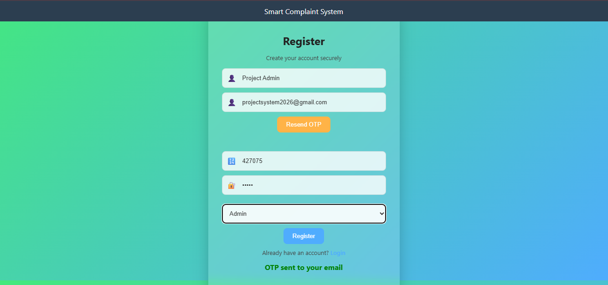

## 🚀 Smart Complaint & Issue Tracking System

A full-stack web application to manage and track complaints efficiently with real-time updates and admin control.

---

## 🚀 Features

* OTP-based user registration
* Complaint submission with optional image upload
* Real-time status tracking (Pending → In Progress → Resolved)
* Admin dashboard for complaint management
* Search and filter functionality
* Email notifications
* Analytics dashboard using Chart.js

---

## 🛠 Tech Stack

* Backend: Spring Boot
* Frontend: HTML, CSS, JavaScript
* Database: MySQL
* Tools: Chart.js, JavaMailSender

---

## 📊 Screenshots

### Admin Dashboard

### User Dashboard

### Complaint Management

### OTP Verification

---

## ⚙️ Setup Instructions

1. Clone the repository
2. Configure database in application.properties
3. Run Spring Boot application
4. Open frontend in browser

---

## 💡 Key Learnings

* REST API development using Spring Boot
* Frontend-backend integration
* Email service integration
* Data visualization using charts

---

## 📌 Future Improvements

* AI-based complaint validation
* Mobile application
* Advanced reporting

---

## 👨‍💻 Author

Shekhar Basappagol
## 👨‍💻 About Me

I built this project to understand real-world full-stack development, including REST APIs, database handling, and UI design.

